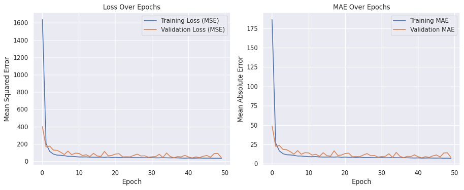

Concrete Compressive Strength Dataset:

This dataset contains data on the compressive strength of concrete, which is a critical factor in construction.
It includes various input parameters such as cement content, water ratio, and age of curing, among others, that influence the overall strength of concrete.
This dataset is ideal for regression analysis and machine learning model development to predict concrete strength based on input variables.

Histogram Features :

Scatter high correlation features with Strength :

MLP with Huber Loss and RMSprop Optimizer :

MLP with Huber Loss and Adam Optimizer :

